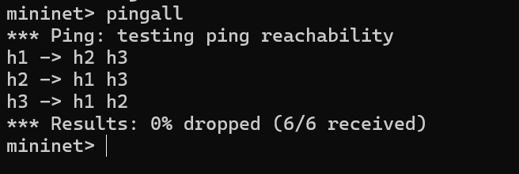
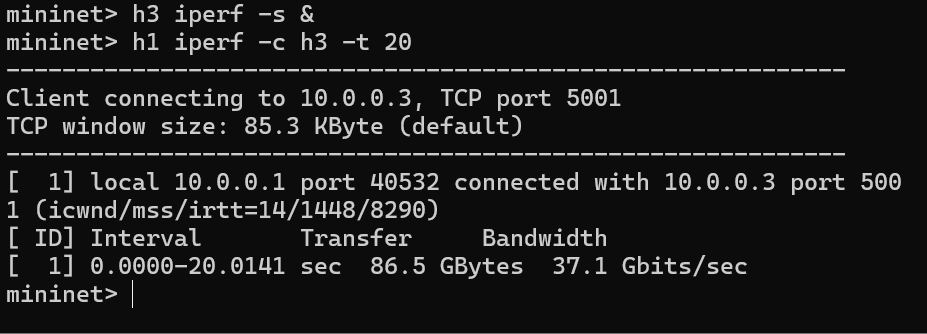
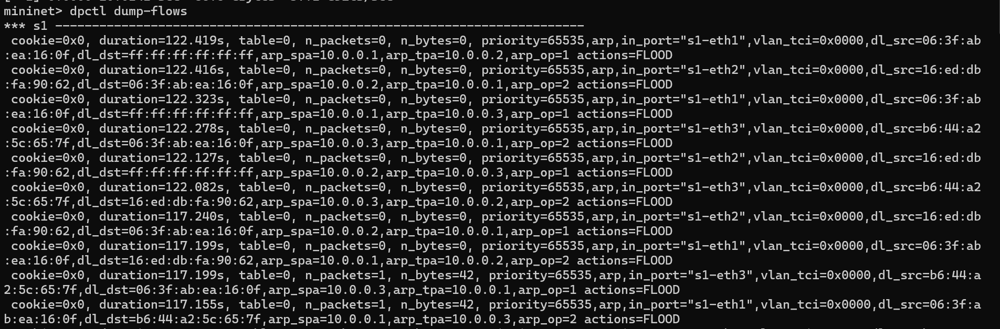
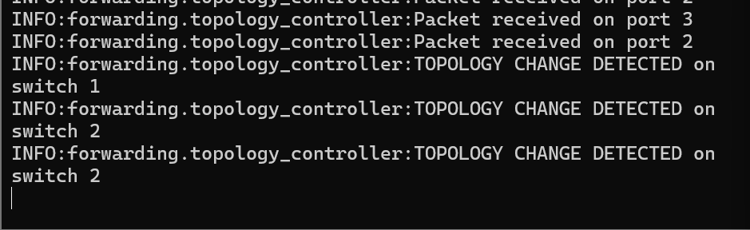

# SDN Topology Change Detector using Mininet and POX

---

## 👤 Student Details

* **Name:** Nallamalli Kanaka Mani Sai Akhil
* **SRN:** PES1UG24CS290

---

## 📌 Problem Statement

In traditional networks, detecting and responding to topology changes such as link failures or switch disconnections is complex and inefficient. This project implements a Software Defined Networking (SDN) solution using Mininet and a POX controller to dynamically detect topology changes and update network behavior in real time.

---

## 🎯 Objectives

* Detect network topology changes dynamically
* Monitor switch and port events using OpenFlow
* Implement match-action flow rules
* Handle PacketIn events
* Demonstrate SDN behavior using Mininet

---

## 🧠 System Design

### 🔹 Network Topology

* Hosts: h1, h2, h3
* Switches: s1, s2
* Controller: POX

```
h1 --- s1 --- s2 --- h3
       |
       h2
```

### 🔹 Design Justification

* Simple topology for clear observation
* Multiple switches enable topology change detection
* POX controller supports event-driven logic

---

## 💻 Source Code Structure

```
SDN-Topology-Change-Detector/
│
├── topology/
│   └── mytopo.py
│
├── controller/
│   └── topology_controller.py
│
├── screenshots/
│   ├── pingall.png
│   ├── iperf.png
│   ├── flow_table.png
│   ├── topology_change.png
│
└── README.md
```

✔ Clean and modular structure
✔ Proper separation of components

---

## ⚙️ Setup & Execution Steps

### 🔹 Step 1: Install Mininet

```bash
sudo apt update
sudo apt install mininet -y
```

---

### 🔹 Step 2: Run POX Controller

```bash
cd pox
./pox.py controller.topology_controller
```

---

### 🔹 Step 3: Run Custom Topology

```bash
sudo mn --custom topology/mytopo.py --topo mytopo --controller=remote
```

---

## 🧪 Test Cases

### ✅ Test Case 1: Connectivity Test

Command:

```bash
pingall
```

Expected Output:

* All hosts reachable
* 0% packet loss

---

### ✅ Test Case 2: Topology Change Detection

Steps:

* Disable a link or port

Expected Output:

* Controller logs:
  **"Topology change detected on switch"**

---

## 📸 Proof of Execution

### 🔹 Ping Results



---

### 🔹 Iperf Results



---

### 🔹 Flow Table Output



---

### 🔹 Topology Change Detection



---

## 📊 Performance Analysis

* Latency measured using `pingall`
* Throughput measured using `iperf`
* Flow rules installed dynamically
* Unknown packets are flooded initially and optimized later

---

## 🔍 Key Concepts Used

* Software Defined Networking (SDN)
* OpenFlow Protocol
* PacketIn Event Handling
* Flow Rule Installation (Match-Action)
* Event-driven Controller

---

## 🚀 Conclusion

The controller dynamically detects topology changes using OpenFlow PortStatus events and updates flow rules accordingly. This demonstrates the flexibility and control provided by SDN in managing dynamic networks.

---

## 🔮 Future Improvements

* Implement learning switch instead of flooding
* Add firewall rules
* Optimize flow rule installation
* Add topology visualization

---

## 📚 References

1. https://mininet.org/overview/
2. https://mininet.org/walkthrough/
3. https://github.com/mininet/mininet
4. https://github.com/noxrepo/pox

---
