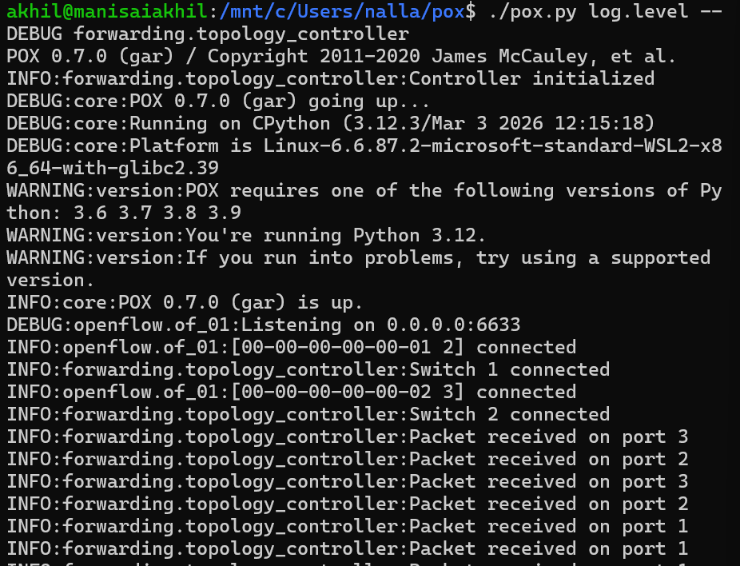

# SDN-Based Topology Change Detection System

**Course:** UE24CS252B — Computer Networks
**Project:** SDN Topology Change Detector
**Controller:** POX | **OpenFlow:** 1.0 | **Emulator:** Mininet

---

##  Student Details

* **Name:** Nallamalli Kanaka Mani Sai Akhil
* **SRN:** PES1UG24CS290

---

##  Problem Statement

In traditional networks, detecting topology changes such as link failures or port status updates is difficult due to distributed control. Software Defined Networking (SDN) centralizes control, allowing dynamic detection and handling of topology changes using a controller.

**Goal:** Detect topology changes (link/port events) in real-time and update network behavior accordingly.

---

##  Objectives

* Detect topology changes dynamically
* Monitor switch and port events using OpenFlow
* Implement match-action flow rules
* Handle PacketIn events
* Demonstrate SDN behavior using Mininet

---

##  Network Topology

```
h1 --- s1 --- s2 --- h3
       |
       h2
```

* Hosts: h1, h2, h3
* Switches: s1, s2
* Controller: POX

---

##  SDN / OpenFlow Design

### Controller Logic

* Switch connects → Controller logs connection
* PacketIn event → Flood packet + install flow rule
* Known flows → Forward using installed rule
* PortStatus event → Detect topology change

---

##  File Structure

```
SDN-Topology-Change-Detector/
├── topology/
│   └── mytopo.py
├── controller/
│   └── topology_controller.py
├── screenshots/
│   ├── pingall.png
│   ├── iperf.png
│   ├── flow_table.png
│   ├── controller_logs.png
│   ├── topology_change.png
└── README.md
```

---

##  Setup & Execution

### Step 1 — Install Mininet

```bash
sudo apt update
sudo apt install mininet -y
```

---

### Step 2 — Run POX Controller

```bash
cd ~/pox
./pox.py controller.topology_controller
```

---

### Step 3 — Run Mininet Topology

```bash
sudo mn --custom topology/mytopo.py --topo mytopo --controller=remote
```

---

## 🧪 Testing Commands

```
pingall
sh ovs-ofctl dump-flows s1
h1 ping -c 3 h2
h3 iperf -s &
h1 iperf -c h3 -t 20
```

---

## 📸 Proof of Execution

### 🔹 Connectivity Test (pingall)


---

### 🔹 Throughput Test (iperf)


---

### 🔹 Flow Table (OpenFlow Rules)


---

### 🔹 Controller Logs (Packet Handling)



---

### 🔹 Topology Change Detection


---

##  Performance Analysis

* Latency verified using pingall (0% packet loss)
* Throughput measured using iperf
* Flow rules dynamically installed in switch
* Controller reduces load after rule installation

---

##  Key Concepts Demonstrated

* OpenFlow controller–switch interaction
* PacketIn event handling
* Flow rule installation (match-action)
* PortStatus event for topology change detection
* Dynamic SDN behavior

---

##  Conclusion

The system successfully demonstrates real-time topology change detection using OpenFlow PortStatus events. The controller dynamically updates network behavior, showcasing the flexibility and centralized control of SDN.

---

##  References

Mininet Documentation
POX Controller Documentation
OpenFlow Specification

---
